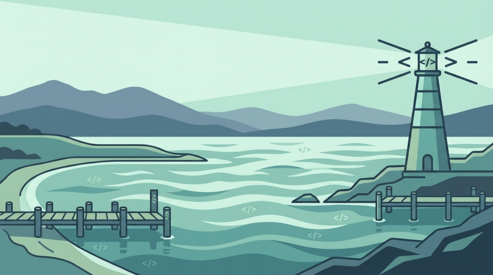
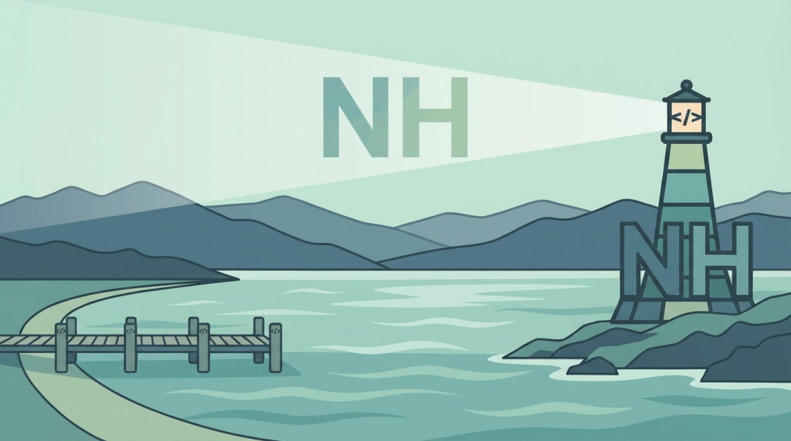
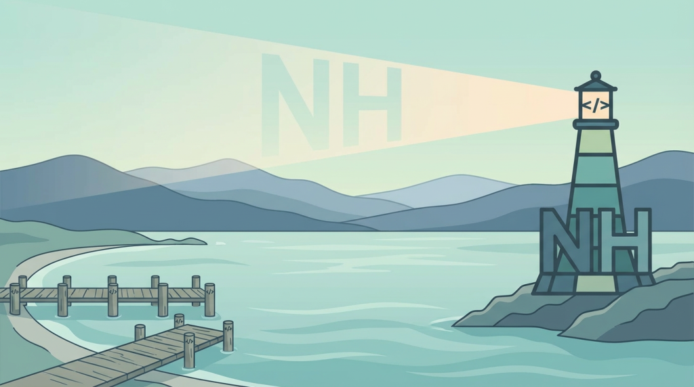
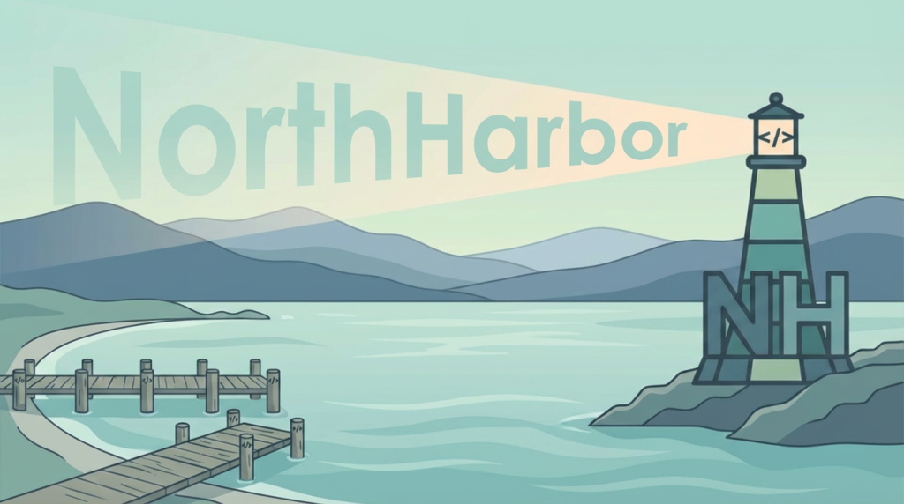
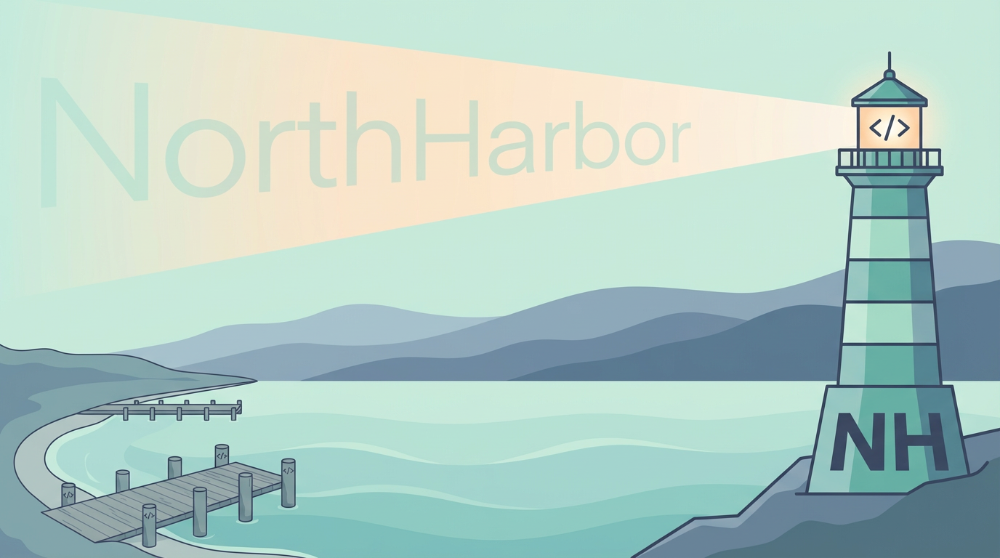
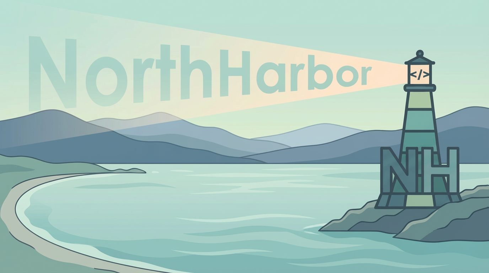

# NorthHarbor Dev Org Banner

**Date:** 2026-02-23

## Summary

A wide panoramic banner for the `northharbor-dev` organization, extending the avatar's lighthouse motif into a full harbor landscape scene. The lighthouse projects a beam containing the "NorthHarbor" name across layered highland mountains, with calm harbor water and a natural coastline.

## Selected Concept

**File:** `07-selected-no-dock.png`

Peaceful harbor scene with the avatar lighthouse on the right, "NorthHarbor" text scaling within the projected beam, layered highland mountains, calm water, and a natural curving shoreline. No dock structures -- clean and serene.

---

## Iteration History

### Iteration 1: Initial Direction

Two approaches were generated to establish the overall composition -- lighthouse in a harbor scene with highlands, waves, and code bracket motifs.

**Option A -- Lighthouse right, dock left, scattered brackets**

Lighthouse on the right with `</>` brackets in the beams. Curving coastline with a wooden dock on the left. Layered highland mountains in the background. `</>` symbols scattered subtly across the water and dock posts. Peaceful and elegant.

**Option B -- Lighthouse left, village right, large brackets**

Lighthouse with NH foundation on a headland to the left, beam sweeping right with large `</>` brackets in the sky. Harbor village with geometric buildings on the right shoreline. More dynamic but blocky and cartoonish.

**Decision:** Option A selected for its peaceful, elegant feel. Option B rejected as too blocky and cartoonish.

---

### Iteration 2: Add NH to the Scene

The avatar lighthouse (with `</>` lantern and NH foundation) was integrated into the Option A composition, with NH projected in the light beam over the mountains.

**V1 -- NH prominent in beam**

NH appears as prominent muted text floating in the lighthouse beam above the mountains. Clear and readable. The beam cone is well-defined.

**V2 -- NH ghostly and translucent**

NH appears as a ghostly, translucent projection within a warmer-toned beam. More subtle and ethereal. The mountains have smoother atmospheric layering.

**Decision:** Liked V1's composition and text prominence. Liked V2's text scaling treatment within the beam. Decided to combine: use V1's overall look with V2's text-scaling-with-beam approach, and change "NH" to "NorthHarbor".

---

### Iteration 3: NorthHarbor Text in Beam

Replaced "NH" with the full word "NorthHarbor" scaling within the projected beam.

**V1 -- NorthHarbor with dock**

"NorthHarbor" scales nicely with the beam, growing larger toward the left. Text is readable and well-integrated. Dock and scene composition from Option A retained.

**V2 -- NorthHarbor softer treatment**

More subtle translucent treatment. The lantern room has a warm glow effect. Mountains flow more smoothly. Overall more refined but text is less readable.

**Decision:** V1 selected for stronger text presence and composition. Dock to be removed for a cleaner look.

---

### Iteration 4: Final -- Remove Dock

Removed the wooden dock/pier from V1, replacing it with a natural curving shoreline.

**Selected: No dock**

Final version. The scene is clean and serene -- natural shoreline on the left, calm harbor water in the foreground, the avatar lighthouse on the right with `</>` lantern and NH foundation, "NorthHarbor" projected in the beam across layered highland mountains. Open and peaceful.

---

## Ideogram Prompt (for polished version)

> Wide panoramic banner in flat minimalist illustration style, 3:1 aspect ratio. Peaceful elegant harbor scene. Right side: a tall lighthouse on a rocky shoreline with teal and seafoam horizontal stripes, dark slate blue outlines, code brackets </> in the glowing lantern room, NH letters in the angled foundation base. The lighthouse projects a soft triangular beam of light sweeping diagonally upward to the left. Within the beam, the word NorthHarbor appears in muted translucent seafoam, scaling larger as the beam widens. Layered rolling highland mountains in progressively lighter slate blue behind. Calm harbor water with stylized flat waves in teal and seafoam. Left side: gentle curving natural coastline, no docks or piers. Light seafoam mint sky. Serene tranquil mood. Flat clean-outlined illustration, muted teal dark slate blue seafoam green mint palette. No photorealism.
