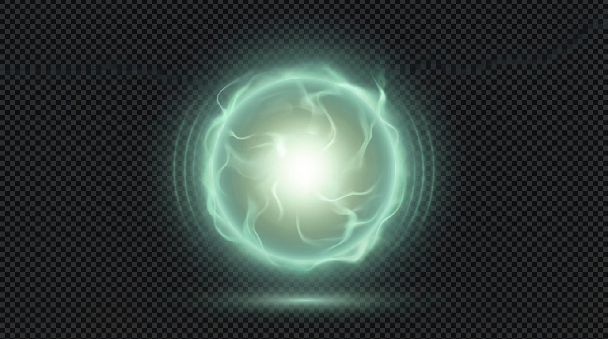
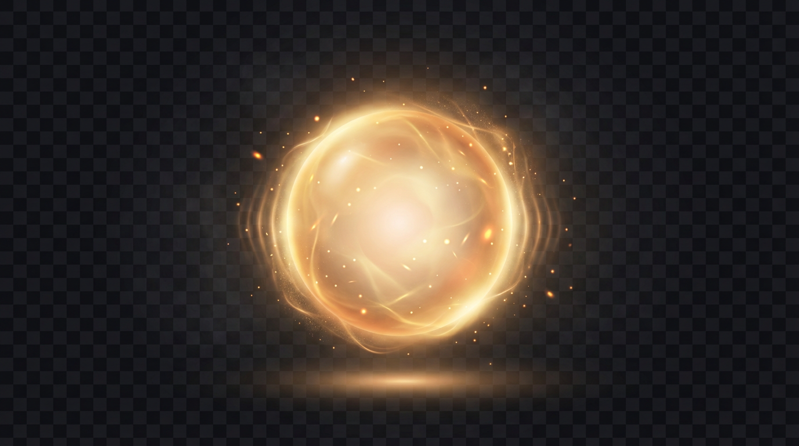
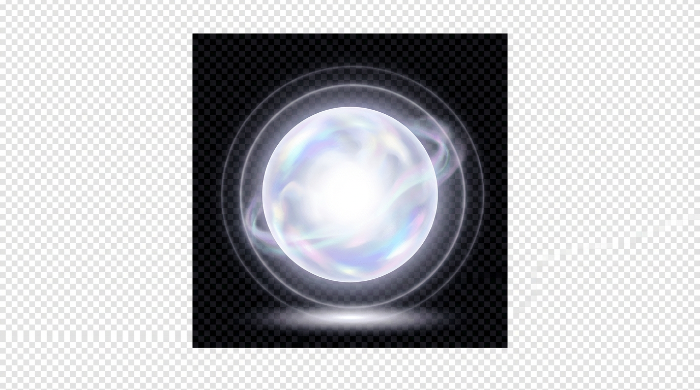
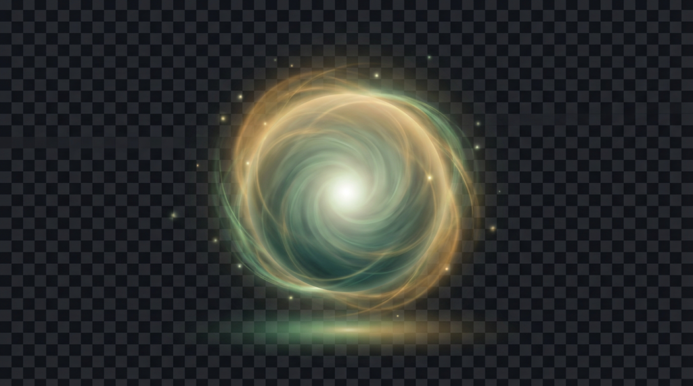
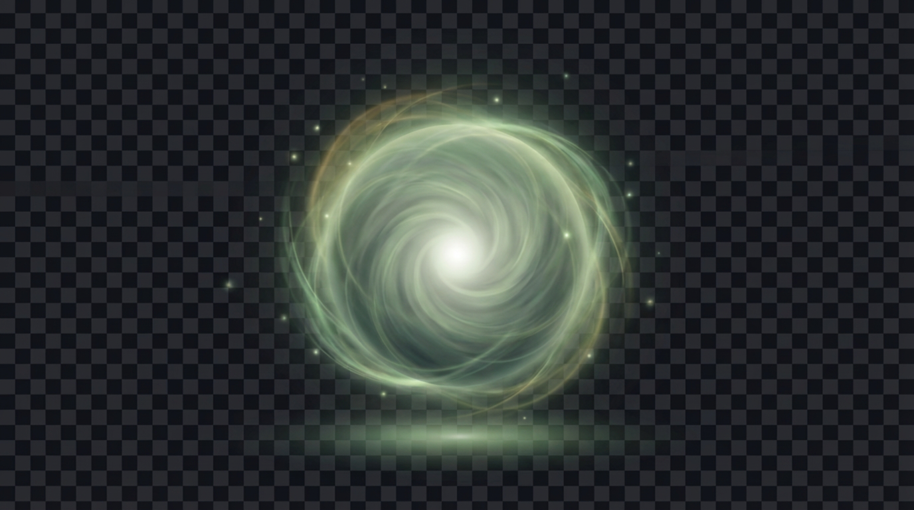

# Sage Orb Avatar

**Date:** 2026-02-23

## Summary

An animated energy orb avatar for the Sage AI assistant. Instead of a humanoid avatar, Sage is represented as a soft glowing ball of radiant energy that communicates state through animation: floating gently at rest, pulsing slowly when thinking, and modulating faster when responding.

## Selected Concept

**File:** `06-selected-calm-v2.png`

Sage green swirl with white core, faint gold threads, floating particles, and a soft glow pool beneath. Calm, meditative, wise.

## Animation States

- **At rest**: Gentle 4s floating bob (6px vertical) + subtle glow breathing. Sage is ready.
- **Thinking**: Slow 2.5s pulsation -- scale grows to 1.08x, brightness increases 15%, outer glow expands. Sage is processing.
- **Responding**: Fast 1.2s irregular modulation -- scale and brightness oscillate with varying intensity like speech rhythms. Sage is talking.

**Interactive prototype:** `prototypes/src/sage-orb/`

## Usage Context

- Floating UI element in the Sage app, position TBD
- Clicking opens the chat interface
- Future: voice input support -- orb responds to audio input
- Works at multiple sizes (40px to 180px)

---

## Iteration History

### Iteration 1: Color Direction

Four color palettes explored for the energy orb concept.

**Sage Green**

Teal/green plasma ball with electric tendrils. Ties to app palette but felt too electric.

**Warm Gold**

Amber/gold with floating ember particles. Warm and inviting but disconnected from brand.

**Pearl**

White/iridescent with pastel shifts. Serene but too neutral -- crystal ball feel.

**Green-Gold Blend**

Sage green core with golden outer swirl. Galaxy/nebula quality. Most dynamic and organic. Selected direction.

**Decision:** Green-gold blend chosen for combining brand alignment (sage green) with warmth (gold).

---

### Iteration 2: Calm Down for At-Rest State

Reduced gold intensity and made the swirl more peaceful for the at-rest state.

**Calm V1**

Softer swirl with gold reduced to faint outer ring. Still has visible motion but more diffused.

**Calm V2 (Selected)**

Deeper, more meditative. Sage green dominant with gold as thin threads. Layered nebula swirl with floating particles and glow pool. "Wisdom at rest" quality.

**Decision:** V2 selected -- calmer, more contemplative. Gold intensifies during thinking/responding states via CSS animation.
